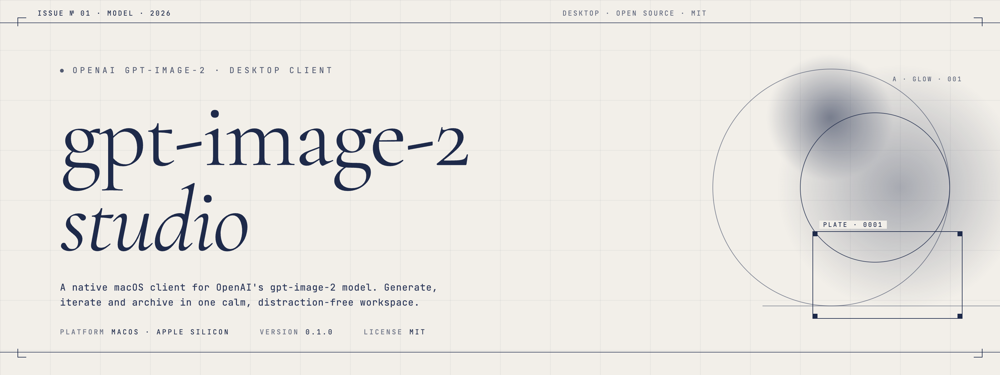
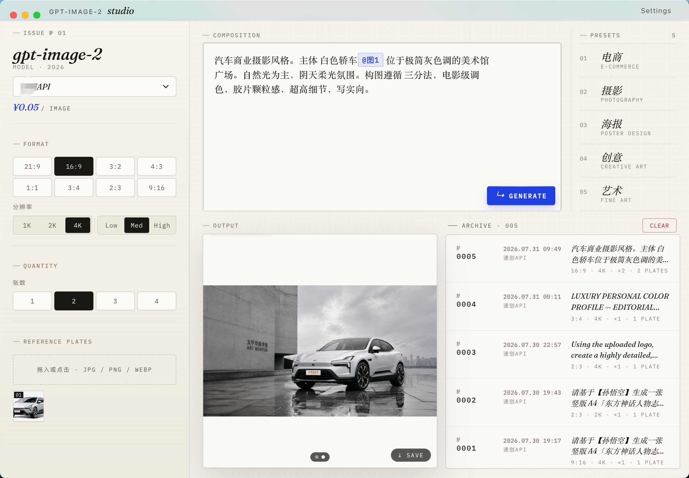
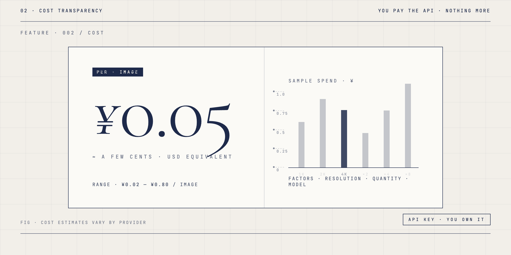
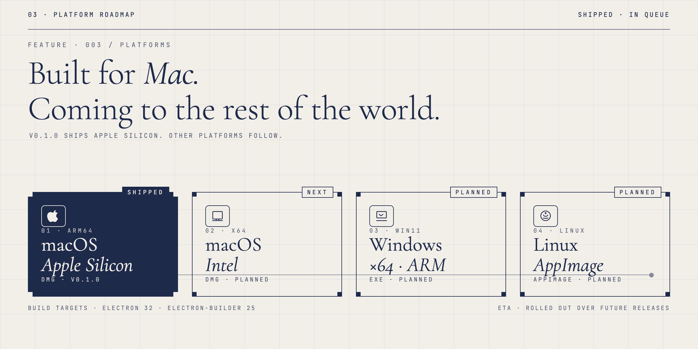

# gpt-image-2 · studio

<p align="center">
  
</p>

<p align="center">
  <a href="https://github.com/ponypray/gpt-image-2-desktop/releases"></a>
  <a href="LICENSE"></a>
  <a href="https://github.com/ponypray/gpt-image-2-desktop/stargazers"></a>
  
</p>

<p align="center">
  <a href="#中文">中文</a> · <a href="#english">English</a> · <a href="docs/LAUNCH-KIT.md">Launch Kit</a>
</p>

---

<a id="中文"></a>

## 中文

### 它是什么

**gpt-image-2 · studio** 是一个 macOS 桌面客户端，用来调用 OpenAI 的 `gpt-image-2` 图像生成模型。
它把官方网页/SDK 里的那些繁琐流程——打开浏览器、配置代理、复制粘贴 Base64、下载图片——
全部塞进了一个安静、克制、可归档的工作台里。

> **生图难？生图贵？生图慢？**
> 这个工具就是为这些痛点做的：本地操作、自己的 API Key、批量出图、可调分辨率/比例/质量。



---

### ✨ 特性

- 🖼 **多比例**：`21:9 / 16:9 / 3:2 / 4:3 / 1:1 / 3:4 / 2:3 / 9:16` 全覆盖
- 📐 **三档分辨率**：`1K / 2K / 4K`
- 🎚 **三档质量**：`Low / Med / High`
- 📚 **5 个内置预设**：电商 / 摄影 / 海报 / 创意 / 艺术
- 🧷 **参考图上传**：拖入或点击，支持 JPG / PNG / WebP
- 🗂 **本机归档**：最近 5 次生成可回看，提示词 + 比例 + 分辨率全保留
- 💾 **一键保存**：把生成的图直接存到磁盘
- 🔑 **自带 Key（BYO）**：你配你的 API Key，成本只走你的通道



---

### 💰 成本说明

这个工具**不收你一分钱**。你看到的每一张图，都是用**你自己的 API Key** 调出来的。

- 单张成本通常在 **几分钱到几毛钱** 之间
- 实际价格取决于你接的 API 服务商（官方或中转），以对方报价为准
- 影响因素：分辨率、生成张数、参考图数量

> 例：界面截图里的 `¥0.05 / image` 是一次中转 API 的真实账单。

---

### 🖥 平台支持



| 平台 | 状态 | 格式 |
| --- | --- | --- |
| **macOS · Apple Silicon (M1/M2/M3/M4)** | ✅ 已发布 v0.1.0 | `.dmg` |
| macOS · Intel | 🔜 下一个 | `.dmg` |
| Windows · x64 / ARM | 📝 计划中 | `.exe` |
| Linux | 📝 计划中 | `.AppImage` |

> 当前版本**仅支持 Apple Silicon Mac**。Intel / Windows / Linux 用户可以先 Star 这个项目，我会按热度来排开发优先级。

---

### 📦 安装

1. 前往 [Releases](../../releases) 页面，下载最新的 `GPT Image 2-0.1.0-arm64.dmg`（约 94 MB）。
2. 双击挂载 DMG，把 `GPT Image 2.app` 拖入 **Applications**。
3. 打开应用，在右上角 **Settings** 里填入你的 API Key 即可开始生图。

> **⚠️ 安装提示"已损坏"？**
> 这不是真的损坏。因为我没有购买 Apple 开发者证书（年费 $99），所以应用**没有经过 Apple 公证**。
> macOS 默认会拦截未公证的应用，按下面的方法处理一次即可：
>
> 1. 在 **系统设置 → 隐私与安全性** 滚到最下方
> 2. 点 **"仍要打开"**
> 3. 之后再双击就不会再弹了
>
> 或者用一行命令解除隔离：
> ```bash
> xattr -cr "/Applications/GPT Image 2.app"
> ```
> 详细的图文教程可以自行搜索「macOS 打开已损坏的应用程序」。

---

### 🛠 自己构建（开发者）

```bash
# 1. 克隆
git clone https://github.com/ponypray/gpt-image-2-desktop.git
cd gpt-image-2-desktop

# 2. 安装依赖
npm install

# 3. 开发模式（带热重载）
npm start

# 4. 打包 DMG（Apple Silicon）
npm run dist:mac
```

构建产物会输出到 `release/` 目录。

---

### 🗺 路线图

- [x] macOS Apple Silicon 首发版本
- [ ] macOS Intel (x64) 版本
- [ ] Windows 11 (x64 / ARM64) 版本
- [ ] Linux (AppImage) 版本
- [ ] 多 API 服务商预设（官方 / Azure / 中转）
- [ ] 历史归档扩展（>5 条）
- [ ] 提示词模板库
- [ ] 批量任务队列

---

### ⭐ 如果这个工具帮到了你

**留下你的 Star，让我知道你们需要。** 这是这个项目继续迭代的最大动力。

[](https://github.com/ponypray/gpt-image-2-desktop/stargazers)

---

### 📄 开源协议

[MIT](LICENSE) © 2026 pony

---

<a id="english"></a>

## English

### What it is

**gpt-image-2 · studio** is a native macOS desktop client for OpenAI's `gpt-image-2`
image generation model. It collapses the usual browser-and-SDK dance — opening a
web console, configuring proxies, copying Base64, downloading plates — into a
calm, opinionated, local workspace.

> **Image generation that is hard, expensive, or slow?**
> This tool exists for those exact pain points: a local client, your own API key,
> batch generation, with full control over ratio / resolution / quality.


---

### ✨ Features

- 🖼 **8 aspect ratios**: `21:9 / 16:9 / 3:2 / 4:3 / 1:1 / 3:4 / 2:3 / 9:16`
- 📐 **3 resolution tiers**: `1K / 2K / 4K`
- 🎚 **3 quality tiers**: `Low / Med / High`
- 📚 **5 built-in presets**: E-Commerce / Photography / Poster Design / Creative Art / Fine Art
- 🧷 **Reference plates**: drag-and-drop or click; JPG / PNG / WebP
- 🗂 **Local archive**: the most recent 5 generations, full prompt + metadata
- 💾 **One-click save** generated plates to disk
- 🔑 **BYO API key**: you bring the key, you pay the provider — nothing else


---

### 💰 Cost

This tool is **free**. Every image you generate is billed to **your own API key**.

- A single image typically costs **a few cents to a few dozen cents (USD)**
- Final cost depends on the provider you configure (OpenAI direct, Azure, or
  a relay). The numbers in the app reflect the provider's own pricing.
- Cost drivers: resolution, plate count, reference image count.

> Example: the `¥0.05 / image` shown in the UI is a real invoice line from a
> third-party relay.

---

### 🖥 Platform support


| Platform | Status | Format |
| --- | --- | --- |
| **macOS · Apple Silicon (M1/M2/M3/M4)** | ✅ Shipped · v0.1.0 | `.dmg` |
| macOS · Intel | 🔜 Next | `.dmg` |
| Windows · x64 / ARM | 📝 Planned | `.exe` |
| Linux | 📝 Planned | `.AppImage` |

> The current release **only supports Apple Silicon Macs**. If you're on Intel /
> Windows / Linux, **please Star this repo** — the priority order will follow
> demand.

---

### 📦 Install

1. Go to the [Releases](../../releases) page and download the latest
   `GPT Image 2-0.1.0-arm64.dmg` (≈ 94 MB).
2. Mount the DMG, drag `GPT Image 2.app` into **Applications**.
3. Launch the app, open **Settings** in the top-right corner, paste your API key,
   and start generating.

> **⚠️ macOS says the app is "damaged"?**
> It isn't. The author has not enrolled in the Apple Developer Program (US$99/yr),
> so the binary is **not notarized** and macOS Gatekeeper blocks it on first run.
> This is normal for unsigned open-source Mac apps. Fix it once:
>
> 1. Open **System Settings → Privacy & Security**, scroll to the bottom
> 2. Click **"Open Anyway"**
> 3. Subsequent launches will be normal
>
> Or remove the quarantine attribute in one command:
> ```bash
> xattr -cr "/Applications/GPT Image 2.app"
> ```
> Search "macOS open damaged app" for a graphical walkthrough.

---

### 🛠 Build it yourself

```bash
# 1. Clone
git clone https://github.com/ponypray/gpt-image-2-desktop.git
cd gpt-image-2-desktop

# 2. Install
npm install

# 3. Dev (with hot reload)
npm start

# 4. Build a DMG (Apple Silicon)
npm run dist:mac
```

The build output lands in `release/`.

---

### 🗺 Roadmap

- [x] macOS Apple Silicon first release
- [ ] macOS Intel (x64) build
- [ ] Windows 11 (x64 / ARM64) build
- [ ] Linux (AppImage) build
- [ ] Multi-provider presets (OpenAI / Azure / relays)
- [ ] Extended history (>5 entries)
- [ ] Prompt template library
- [ ] Batch task queue

---

### ⭐ If this helped

**Leave a star — it tells me people actually need this.**
That's the single biggest signal that the next platform build should be next.

[](https://github.com/ponypray/gpt-image-2-desktop/stargazers)

---

### 📄 License

[MIT](LICENSE) © 2026 pony
